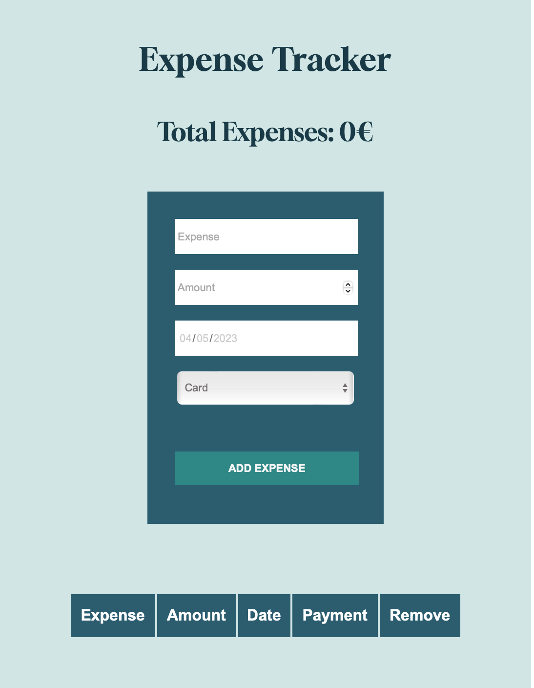

# JavaScript Expense Tracker App

#### This app is a part of Odin project’s curriculum and servers as an example project for my personal web development portfolio. 

Expense tracker app lets users keep track of all their expenses including the date when they were made and option to choose whether they were payed with cash or card. App is using Local Storage to keep users data in the browser. 

### Build with:

- JavaScript
- HTML 5
- CSS 3

*View and interact with the project [here](https://maarbay.github.io/expense-tracker-app)*

This application is built to showcase my understanding of JavaScript, alongside the ability to implement CSS and HTML. 
